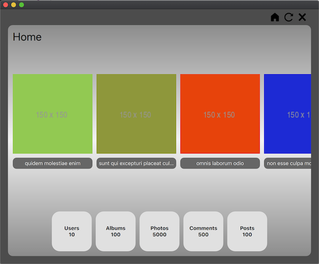
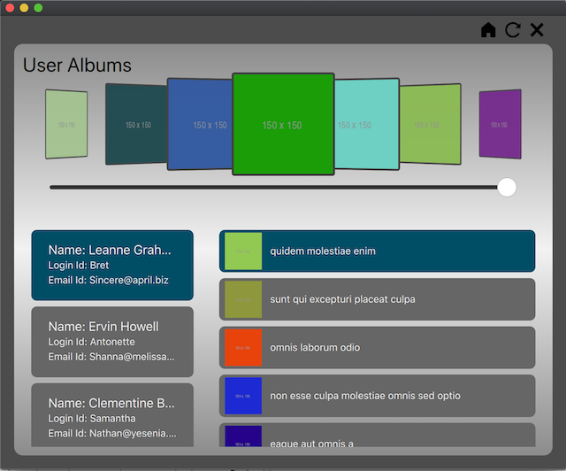
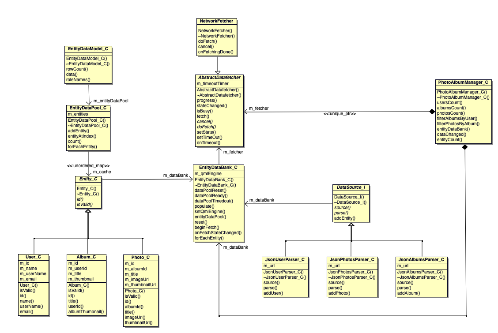

# PhotoAlbum
PhotoAlbum App that pulls data using RestAPI from https://jsonplaceholder.typicode.com/. 

## Features
* The App has four pages Home Page, User Page, Album Page and Photo Page.
* The application uses model/view design principles to expose the data to views. 
* The application fetches the data in a worker thread. The UI is populated once data is availble. 
* User can refresh the data from the datasource. 
* The application can be extended to add multiple data sources.

## Screenshots
 

# Build instructions
## Dependencies
C++ 14, Qt 5.14, QMake

## Instructions
* Create build directory 'build'
* cd build
* qmake ../src/PhotoAlbum.pro
* make (use -j4 where 4 is number of parallel jobs)

Once the make tool finishes, the application binary should be available in the 'build' directory. for Example in case of macOS the app package name shall be PhotAlbum.app

# Unit tests
## Dependencies
Google test  [Download](https://github.com/google/googletest/archive/release-1.10.0.zip)
Qt 5.14, QML, QMake

## Instructions
* Extract the 'googletest' sources in the parent directory of 'PhotoAlbum'. i.e 'PhotoAlbum' and 'googletest' directories should be sibilings.
* Create build directory 'build-tests'
* cd build-tests
* qmake ../tests/unit_tests.pro
* make (use -j4 where 4 is number of parallel jobs)

Once the make tool finishes, run the binary "unit_tests"

# Class Diagram

# ToDos
## Tasks
* Implement Posts and Comments.

